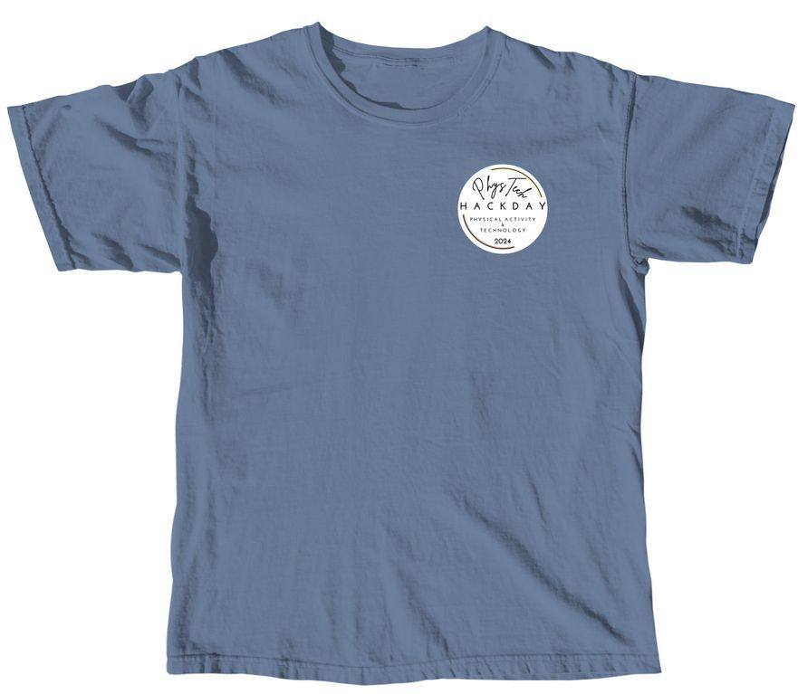
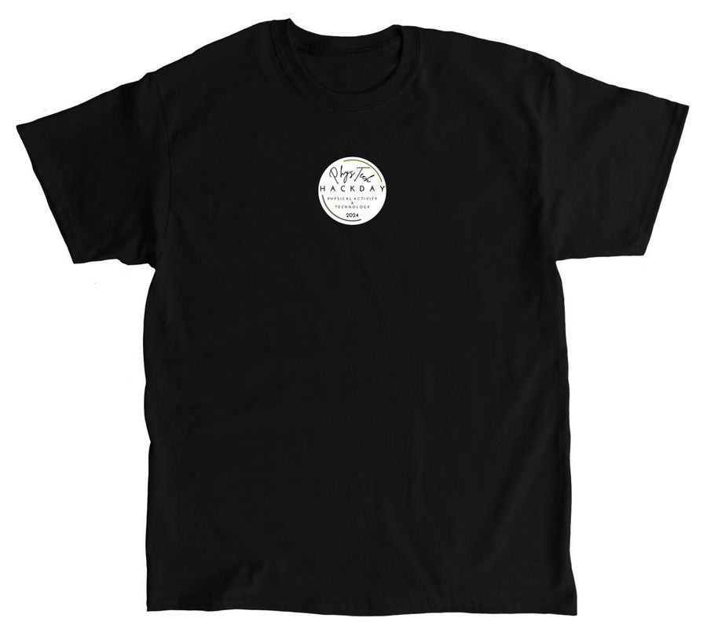
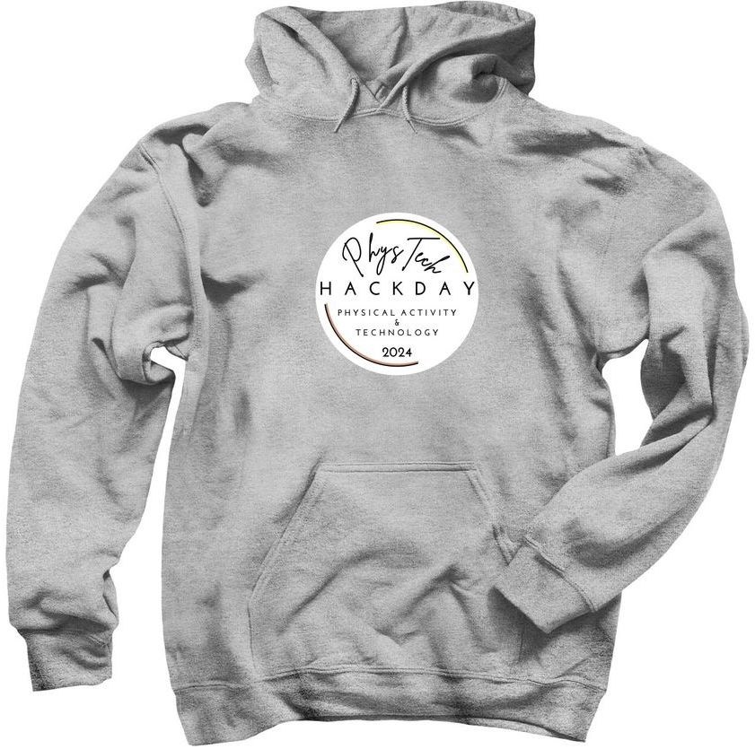
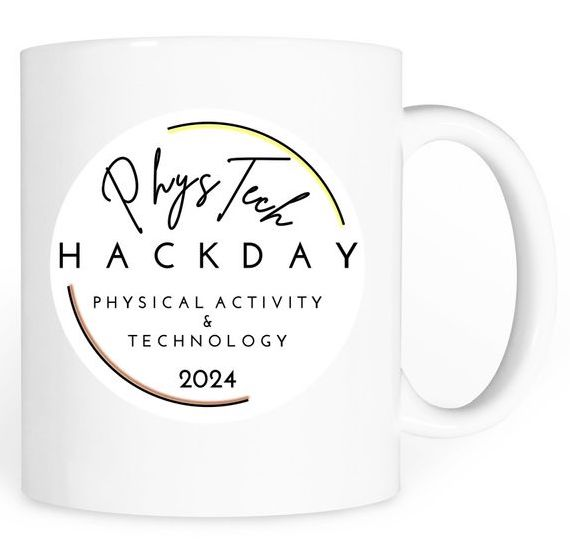

<h1 style="text-align: center;">
PhysTech 2024
</h1>
<h3 style="text-align: center;">
Physical Activity and Technology Hack Day
</h3>
<h3 style="text-align: center;">
June 30, 2024 (Sun), EST
</h3>

[<a href="#overview">Overview</a> | <a href="#requirements">Requirements</a> | <a href="#prizes">Prizes</a> | <a href="#judges">Judges</a> | <a href="#organizers">Organizers</a> | <a href="#merchandise">Merchandise</a>]

## Award Winners of PhysTech 2024:

**Grand Prix: **
- Anshul Kotagiri, PushUpPro - The best way to work out! 

**2nd Place: ** 
- Nikichi Tsuchida, Fencing Acceleration Tracker!

**3rd Place: ** 
- Hanna Suzuki, Portable WBGT Tracker for Outdoor Athletes in the Heat

**Honorable Mention: ** 
- Hiroki Kudara, Soccer Display

**Excellence in Research Award: ** 
- Shun Nagata, RCV Visualizer

**Excellence in Entrepreneurship Award: ** 
- Eshan Aditya Vasipalli, Active+
- Don Tjandra, TaijiFlow

**Excellence in Creativity Award: **
- Hanna Suzuki, Glow in the Dark Skateboard

**Emerging Talent Award: **
- Rei Nagata, Fishing Tracker

## Hackathon Overview:

PhysTech is an online international hackathon for anyone who does, watches, analyzes and promotes physical activities - including sports, workouts, fitness exercises, casual hobbies/pastimes and recreational adventures.

PhysTech welcomes any types of physical activities. Sports, physical training and exercise are in. Yoga, pilates, jogging, cycling and hiking? Of course. Skiing, skating, swimming, dancing, ballet, kayaking, skateboarding, rock/mountain climbing or horseback riding? Sure. Fishing, bowling, paddleboarding, scuba diving, rafting, cheerleading, outdoor bird watching, gardening, kite flying, disk golf (frisbee), or cornhole? Why not!

Not only athletes and recreational players/practitioners, but fans, coaches, referees/judges and analysts are also welcome.

PhysTech offers you a platform to address various needs, wants and challenges in physical activities and produce creative solutions (hacks) with technology.

PhysTech welcomes anyone of all ages and all technical skills, from limited experience to advanced.

Entry is free.

## Expected Project Topics:

Expected project topics include, but are not limited to: 

- Monitoring and enhancing performance
- Logging and tracking practice, training and exercise
- Recording, analyzing and communicating activity data 
- Applying data analytics to physical activity
- Enhancing fan experience 
- Increasing participation/engagement in physical activity
- Promoting health and wellness though physical activity
- Preventing and helping heal from injuries
- Improving dietary and nutritional assistance 
- Protecting and improving the environment for physical activity

<!--
- Analyzing professional sports
- Enhancing sports performance
- Improving your physical well-beings
- Encouraging physical activity to others
- Tracking exercise progress
-->

Solutions can take many different forms such as apps, games, social platforms, web sites/services, devices, sensors, robots, audio/video, data collection/storage, data analysis/forecasts, data visualization, information retrieval, and 3-dimensional modeling/printing. 

## Requirements:

**Project Work:** PhysTech is a “flexible” online hackathon. You can work on your project anytime until 12pm on June 29 (Sat), EST.

**Project Submission:** You are required to complete **ALL of the following 3 requirements:**

- Submit your project to [Depost](https://phystech-2024-20890.devpost.com/) by **12pm on June 29 (Sat), EST**.
- Register your project presentation on a Google Forms page by **12pm on June 29 (Sat), EST**.
- Give a project presentation online at **June 30 (Sun), EST**.

The deadlines are firm. No extensions will be given. Failure to meet the above requirements will disqualify you (and your team) in award judging. 

A link for presentation registration will be shared in the PhysTech 2024 channel of Discord. To register your presentation, you will be asked to submit:

- Your name and contact info
- Your country of residence
- Your project presentation title
- An abstract (short one-paragraph description) of your project
- A publicly accessible link to your project placed on a cloud-based code repository (e.g. GitHub) or storage (e.g. Google Drive). We will verify the actual outcome of your work with this link in the afternoon of June 29. Please note that **we will not schedule your presentation if we cannot verify your actual work**. You can submit a link to your project on Devpost; however, please make sure that the link references the actual outcome of your work. 

**Project presentation:** We will announce the schedule of project presentations (i.e. what time each presentation starts) by early morning of June 30 (Sun), EST. A Zoom link will be made available in the PhysTech 2024 channel of Discord. 

In our current plan, you will have 10 minutes in total for your presentation, including approx. 3 minutes for QAs with judges and other participants. 

## Prizes and Judging:

**Certificates:** Every participant will receive a certificate of participation. 

**Prizes:** 

- Grand Prix (1st Place)
- 2nd Place
- 3rd Place
- Honorable Mention (x4)
- Excellence in Innovation Award
- Excellence in Research Award
- Excellence in Creativity Award
- Excellence in Entrepreneurship Award
- Emerging Talent Award
- Key Contributor Award

A panel of judges will select and announce prize winners at the end of the event. Prize winners will receive special certificates.

**Book chapter publication:** We will publish a book that features the projects presented at PhysTech 2024. Selected participants will be invited to extend their project abstracts and publish them as book chapters. We are planning to publish this book through Amazon Kindle Direct Publishing.

**Judging Criteria:**

- **Impact:** How much impact (quality and quantity) can this project have? Does it solve a big problem or a small problem? Will it inspire or help many or a few?
- **Creativity:** How creative/innovative is this project? Is it something that hasn’t been attempted before, or is it an incremental improvement on something that already exists?
- **Presentation:** How well did the team/individual communicate this project? Was the presentation effective in telling the story of the project: why it is important, what challenge it addresses, and how it delivers a solution?

## Judges: 

- Harish Kamath
- PhysTech Advisory Board

## Organizing Committee:

- Hiroki Kudara
- Rei Nagata
- Shun Nagata (Co-chair)
- Koki Okusha
- Sarasa Ouchi (Co-chair)
- Hanna Suzuki
- Nikichi Tsuchida
- Uta Tsuchida

## Merchandise:

We run an online store where you can find gifts for yourself, family members and friends.

