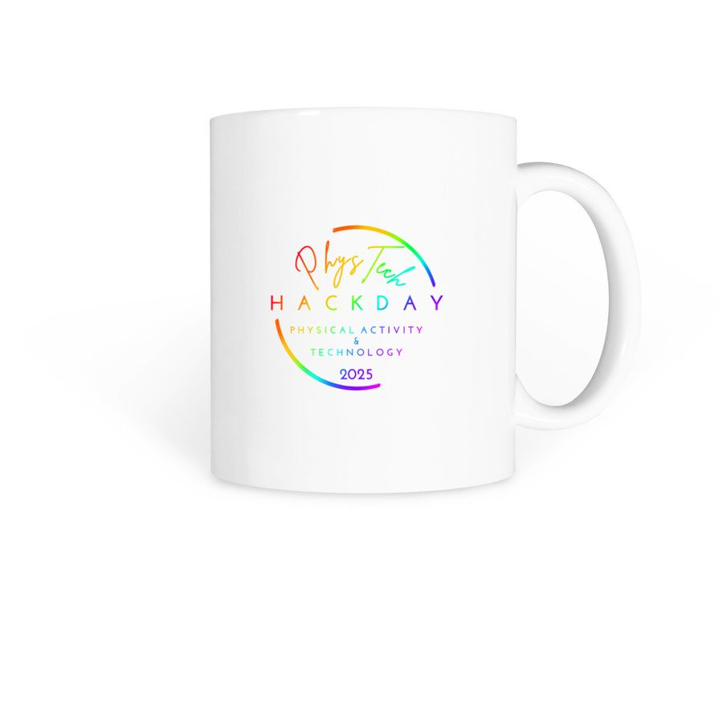

<h1 style="text-align: center;">
PhysTech 2025
</h1>
<h3 style="text-align: center;">
Physical Activity and Technology Hack Day
</h3>
<h3 style="text-align: center;">
June 29, 2025 (Sun), EST
</h3>

<b><a href="https://phystech2025.devpost.com/">Devpost page</a></b>

[<a href="#overview">Overview</a> | <a href="#requirements">Requirements</a> | <a href="#prizes">Prizes</a> | <a href="#judges">Judges</a> | <a href="#organizers">Organizers</a> | <a href="#merchandise">Merchandise</a>]

## Award Winners of PhysTech 2025:

**Grand Prix:**
- Pin-Yu Chen, Cheng-Hsuan Wu, Kuan-Ting Chen, Ta-Kang Kao, and Ping-Chen Chung, [Runalyze - Analyze your run](https://devpost.com/software/runalyze)

**2nd Place**
- Ahmed Raza Khan and Purusottam Nalla, [Postra - Train Smart, Move Right](https://devpost.com/software/phytech)
- Hanna Suzuki, [AlertAthlete](https://devpost.com/software/alertathlete-real-time-alert-tracker-for-outdoor-athletes)

**3rd Place**
- Somdath Devansh Agarwal and Mayank Srivastava, [Smart Workout DashBoard - FitTrack](https://devpost.com/software/smart-workout-dashboard-9fb23i)
- Konomi Karube, [Badminton target](https://devpost.com/software/badminton-target)
- Hanna Suzuki, [Sip Log](https://devpost.com/software/sip-log-a-water-intake-monitor-and-reminder)

**Honorable Mention**
- Ayaan Kayastha, [Basketball Shot Analyzer](https://devpost.com/software/shot-anazlyer)
- Nik Reshamwala, John Gambill, and Kieran Goldstein, [FridgeFit](https://devpost.com/software/fridgefit-of5iv0)

 **Kintone Integration Challenge Award**
- Ayaan Kayastha, [Basketball Shot Analyzer](https://devpost.com/software/shot-anazlyer)

**Excellence in Creativity Award**
- Babitha Karre, [Fan Fuel](https://devpost.com/software/fan-fuel)
- Urja Vaidya, [FitBot](https://devpost.com/software/fitbot-rpjewx)

**Excellence in Research Award**
- Vedant Bhatia, [BioSync](https://devpost.com/software/biosync-p86mx0)
- Alyssa Yasuhara, [Gymnastics At-Home Form Trainer](https://devpost.com/software/gymnastics-at-home-form-trainer)

**Excellence in Entrepreneurship Award**
- Sk Md Rizwan, [MedExchange](https://devpost.com/software/medexchange)

**Emerging Talent Award**
- Rei Nagata, [Schedule Indicator](https://devpost.com/software/schedule-indicator)

**Key Contributor Award**
- Piyush Pandey, [FitTracker-PRO](https://devpost.com/software/fittracker-pro)

## Hackathon Overview:

PhysTech is an online international hackathon for anyone who does, watches, analyzes and promotes physical activities - including sports, workouts, fitness exercises, casual hobbies/pastimes and recreational adventures.

PhysTech welcomes any types of physical activities. Sports, physical training and exercise are in. Yoga, pilates, jogging, cycling and hiking? Of course. Skiing, skating, swimming, dancing, ballet, kayaking, skateboarding, rock/mountain climbing or horseback riding? Sure. Fishing, bowling, paddleboarding, scuba diving, rafting, cheerleading, outdoor bird watching, gardening, kite flying, disk golf (frisbee), or cornhole? Why not!

Not only athletes and recreational players/practitioners, but fans, coaches, referees/judges and analysts are also welcome.

PhysTech offers you a platform to address various needs, wants and challenges in physical activities and produce creative solutions (hacks) with technology.

PhysTech welcomes anyone of all ages and all technical skills, from limited experience to advanced.

Entry is free.

## Expected Project Topics:

Expected project topics include, but are not limited to: 

- Monitoring and enhancing performance
- Logging and tracking practice, training and exercise
- Recording, analyzing and communicating activity data 
- Applying data analytics to physical activity
- Enhancing fan experience 
- Increasing participation/engagement in physical activity
- Promoting health and wellness though physical activity
- Preventing and helping heal from injuries
- Improving dietary and nutritional assistance 
- Protecting and improving the environment for physical activity

<!--
- Analyzing professional sports
- Enhancing sports performance
- Improving your physical well-beings
- Encouraging physical activity to others
- Tracking exercise progress
-->

Solutions can take many different forms such as apps, games, social platforms, web sites/services, devices, sensors, robots, audio/video, data collection/storage, data analysis/forecasts, data visualization, information retrieval, and 3-dimensional modeling/printing. 

## Requirements:

**Project Submission:** You are required to complete **ALL of the following 3 requirements:**

- Submit your project to [Devpost](https://phystech2025.devpost.com/) by **12pm on June 28 (Sat), EST**.
- Register your project presentation on a Google Forms page by **12pm on June 28 (Sat), EST**.
- Give a project presentation online on **June 29 (Sun), EST**.

The deadlines are firm. No extensions will be given. Failure to meet these requirements will disqualify you (and your team) in award judging. 

A link for presentation registration will be shared in the PhysTech 2025 channel of Discord. To register your presentation, you will be asked to submit:

- Your name and contact info
- Your country of residence
- Your project presentation title
- A summary of your project (short one-paragraph description)
- A publicly accessible link to your project placed on a cloud-based code repository (e.g. GitHub) or storage (e.g. Google Drive). We will verify the actual outcome of your work with this link. Please note that **we will not schedule your presentation if we cannot verify your actual work**. You can submit a link to your Devpost project page; however, please make sure that your Devpost page references the actual outcome of your work. 

**Project presentation:** We will announce the schedule of project presentations (i.e. what time each presentation starts) by early morning of June 29 (Sun), EST. A Zoom link will be made available in the PhysTech 2025 channel of Discord.

In our current plan, we will start PhysTech around the noon of June 29 (Sun), EST. However, we may adjust this based on the locations (time zones) of presentation speakers. 

You will have 10 minutes in total for your presentation, including approx. 3 minutes for QAs with judges and other participants. 

## Prizes and Judging:

**Certificates:** Every participant will receive a certificate of participation. 

**Prizes:** 

- Grand Prix (1st Place)
- 2nd Place
- 3rd Place
- Honorable Mention (x4)
- Kintone Integration Challenge Award
- Excellence in Innovation Award
- Excellence in Research Award
- Excellence in Creativity Award
- Excellence in Entrepreneurship Award
- Emerging Talent Award
- Key Contributor Award

A panel of judges will select and announce prize winners at the end of the event. Prize winners will receive special certificates.

**Book chapter publication:** We will publish a book that features the projects presented at PhysTech 2025. Selected participants will be invited to extend their project abstracts and publish them as book chapters. We are planning to publish this book through Amazon Kindle Direct Publishing. See [PhysTech 2024](books.md#book24) book for your reference. 

**Judging Criteria:**

- **Impact:** How much impact (quality and quantity) can this project have? Does it solve a big problem or a small problem? Will it inspire or help many or a few?
- **Creativity:** How creative/innovative is this project? Is it something that hasn’t been attempted before, or is it an incremental improvement on something that already exists?
- **Presentation:** How well did the team/individual communicate this project? Was the presentation effective in telling the story of the project: why it is important, what challenge it addresses, and how it delivers a solution?

## Judges: 

- Kentaro Sugimoto
- Sarasa Ouchi
- PhysTech Advisory Board

## Organizing Committee:

- Konomi Karube
- Naomi McCreary
- Rei Nagata (Co-chair)
- Shun Nagata (Co-chair)
- Hanna Suzuki (Co-chair)
- Sougou Tojima
- Alyssa Yasuhara
- Rimi Yoshikawa

## Advisory Board:

- Eriko Nishimoto
- Sarasa Ouchi

## Merchandise:

<table>
<tr>
    <td>Logo Mug</td>
        <td>
         
White logo

        </td>
        <td>
         
Rainbow logo

        </td>
        <td>
         
White logo two-tone

        </td>
        <td>
         
Rainbow logo two-tone

        </td>
  </tr>
  <tr>
    <td>Mug</td>
        <td>
         
Yoga

        </td>
        <td>
         
Tug of war

        </td>
        <td>
         
Swimming

        </td>
  </tr>
  <tr>
    <td>Mug</td>
        <td>
        </td>
  </tr>
  <tr>
    <td>3D Long Sleeve Tee, Hoodie, Tank top</td>
        <td>
        </td>
  </tr>
  <tr>
    <td>"Hiragana" Tee, Hoodie, Long Sleeve Tee</td>
        <td>
        </td>
  </tr>
  <tr>
    <td>"Kanji" Tee, Tank Top, Long Sleeve Tee, Hoodie</td>
        <td>
        </td>
  </tr>
  <tr>
    <td>Yoga Bear Tee, Performance Tee, Pullover, Hoodie</td>
        <td>
         
Center-chest

        </td>
        <td>
         
Left-chest

        </td>
  </tr>
  <tr>
    <td>Swimming Tee, Performance Tee, Pullover, Hoodie</td>
        <td>
         
Center-chest

        </td>
        <td>
         
Left-chest

        </td>
  </tr>
  <tr>
    <td>Tug of War Tee, Performance Tee, Hoodie</td>
        <td>
         
Center-chest

        </td>
        <td>
         
Left-chest

        </td>
  </tr>
  <tr>
    <td>"Innovation in Motion" T-shirt (center chest)</td>
        <td>
         
White logo

        </td>
        <td>
         
White logo

        </td>
        <td> 
         
Rainbow logo

        </td>
        <td>
         
Rainbow logo

        </td>
  </tr>
  <tr>
    <td>"Innovation in Motion" T-shirt (left chest)</td>
        <td>
         
White logo

        </td>
        <td>
         
White logo

        </td>
        <td> 
         
Rainbow logo

        </td>
        <td>
         
Rainbow logo

        </td>
  </tr>
  <tr>
    <td>"Hack What Moves You" T-shirt</td>
        <td>
         
White logo

        </td>
        <td>
         
White logo

        </td>
        <td> 
         
Rainbow logo

        </td>
        <td>
         
Rainbow logo

        </td>
  </tr>
<tr>
    <td>"Innovation in Motion" Performance Tee (center chest)</td>
        <td>
         
White logo

        </td>
        <td>
         
White logo

        </td>
        <td> 
         
Rainbow logo

        </td>
        <td>
         
Rainbow logo

        </td>
  </tr>
<tr>
    <td>"Innovation in Motion" Performance Tee (left chest)</td>
        <td>
         
White logo

        </td>
        <td>
         
White logo

        </td>
        <td> 
         
Rainbow logo

        </td>
        <td>
         
Rainbow logo

        </td>
  </tr>
  <tr>
    <td>"Hack What Moves You" Performance Tee</td>
        <td>
         
White logo

        </td>
        <td>
         
White logo

        </td>
        <td> 
         
Rainbow logo

        </td>
        <td>
         
Rainbow logo

        </td>
  </tr>
  <tr>
    <td>"Innovation in Motion" Nike Performance Tee (center chest)</td>
        <td>
         
White logo

        </td>
        <td>
         
White logo

        </td>
        <td> 
         
Rainbow logo

        </td>
        <td>
         
Rainbow logo

        </td>
  </tr>
  <tr>
    <td>"Innovation in Motion" Nike Performance Tee (left chest)</td>
        <td>
         
White logo

        </td>
        <td>
         
White logo

        </td>
        <td> 
         
Rainbow logo

        </td>
        <td>
         
Rainbow logo

        </td>
  </tr>
  <tr>
    <td>"Hack What Moves You" Nike Performance Tee</td>
        <td>
         
White logo

        </td>
        <td>
         
White logo

        </td>
        <td> 
         
Rainbow logo

        </td>
        <td>
         
Rainbow logo

        </td>
  </tr>
  <tr>
    <td>"Innovation in Motion" Hoodie</td>
        <td>
         
White logo center-chest

        </td>
        <td>
         
Rainbow logo center-chest

        </td>
        <td> 
         
White logo left-chest

        </td>
        <td>
         
Rainbow logo left-chest

        </td>
  </tr>
  <tr>
    <td>"Hack What Moves You" Hoodie</td>
        <td>
         
White logo center-chest

        </td>
        <td>
         
Rainbow logo center-chest

        </td>
  </tr>
  <tr>
    <td>Logo Windbreaker</td>
        <td>
         
White logo

        </td>
        <td>
         
Rainbow logo

        </td>
  </tr>
  
</table>

