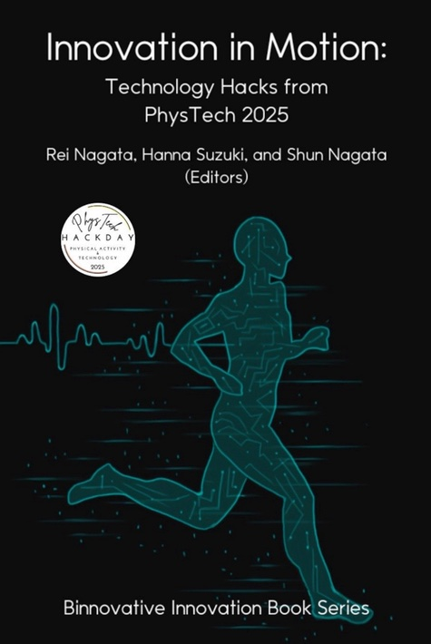

<h1 style="text-align: center;">
Annual PhysTech Proceedings</h1>

We publish the proceedings of each AnimalHack event as a book through Amazon Kindle Direct Publishing (KDP). Selected participants are invited to extend their project abstracts and publish them as book chapters. 

## Proceedings of PhysTech 2025

R. Nagata, H. Suzuki and S. Nagata (eds.), *[Innovation in Motion: Technology Hacks from PhysTech 2025](https://www.amazon.com/dp/B0FR13T4KH)*, 144 pages, Binnovative Innovation Book Series, Binnovative, ISBN: 979-8-2639-6243-2, September 2025.

 
<b>Book cover design: Rimi Yoshikawa</b>

This book showcases a selection of award-winning projects from PhysTech 2024. PhysTech is an annual international hackathon for anyone who does, watches, analyzes and promotes any physical activities – including sports, workouts, fitness exercises, casual hobbies/pastimes and recreational adventures. It offers you a platform to address various needs, wants and challenges in physical activities and produce creative solutions (hacks) with technology.

This book consists of the following 11 chapters:

- Chapter 1: Konomi Karube, Badminton Target
- Chapter 2: Hanna Suzuki, Sip Log: A Mobile Water Intake Monitor and Reminder
- Chapter 3: Alyssa Yasuhara, Gymnastics At-Home Form Trainer
- Chapter 4: Rei Nagata, Health Reminder
- Chapter 5: Sk Md Rizwan and Deepshikha Dutta, MedExchange
- Chapter 6: Ayaan Kayastha, Shot Analyzer: AI-Powered Basketball Form Feedback Using Pose Estimation
- Chapter 7: Pin-Yu Chen, Cheng-Hsuan Wu, Kuan-Ting Chen, Ta-Kang Kao, Ping-Chen Chung, Runalyze
- Chapter 8: Babitha Karre, Fan Fuel: Superstitious Fitness Motivation
- Chapter 9: Hanna Suzuki, AlertAthletes: A Real-time Alert Tracker for Outdoor Athletes in the Summer
- Chapter 10: Vedant Bhatia, BioSync: AI-Powered Personal Health Optimizer for Real-Time Exercise Monitoring
- Chapter 11: Urja Vaidya, FitBot

## Proceedings of PhysTech 2024

Shun Nagata and Sarasa Ouchi (eds.), *[Technology Hacks for Fitness, Sports and Outdoor Activities: Innovative Projects from PhysTech 2024](https://www.amazon.com/dp/B0DQX74Y9H)*, Binnovative Innovation Book Series, 109 pages, Binnovative, ISBN: 979-8-3031-7444-3, December 2024.

 
<b>Book cover design: Rimi Yoshikawa</b>

This book showcases a selection of award-winning projects from PhysTech 2024. PhysTech is an annual international hackathon for anyone who does, watches, analyzes and promotes any physical activities – including sports, workouts, fitness exercises, casual hobbies/pastimes and recreational adventures. It offers you a platform to address various needs, wants and challenges in physical activities and produce creative solutions (hacks) with technology.

This book consists of the following 8 chapters:

- Chapter 1: Hanna Suzuki, Glow in the Dark Skateboard: A Futuristic and Smart
Skateboard
- Chapter 2: Rei Nagata: Fishing Tracker
- Chapter 3: Nikichi Tsuchida, Fencing Priority Referee: A Wearable Sensor for Data-centric Priority Judgment
- Chapter 4: Shun Nagata, Runs Created Value (RCV):A New Batting Performance Statistic in Baseball
- Chapter 5: Hanna Suzuki, Portable WBGT Tracker forOutdoor Athletes in the Heat
- Chapter 6: Vasipalli Eshan Aditya, Active+
- Chapter 7: Anshul Kotagiri, PushUpPro
- Chapter 8: Hiroki Kudara, Soccer Display

