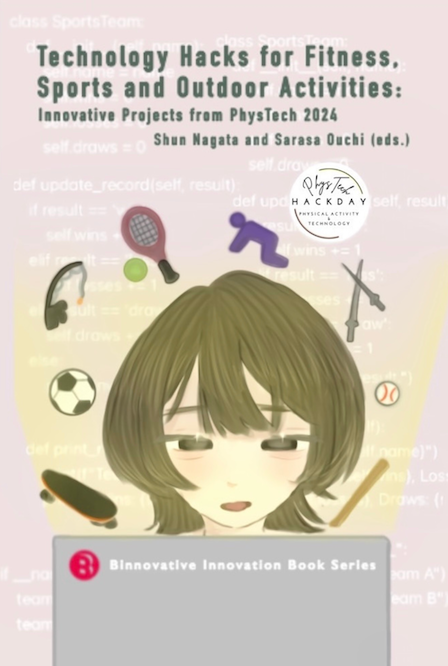

<h1 style="text-align: center;">
PhysTech 2024
</h1>
<h3 style="text-align: center;">
Physical Activity and Technology Hack Day
</h3>
<h3 style="text-align: center;">
June 30, 2024 (Sun), EST
</h3>

[<a href="#overview">Overview</a> | <a href="#requirements">Requirements</a> | <a href="#prizes">Prizes</a> | <a href="#judges">Judges</a> | <a href="#organizers">Organizers</a> | <a href="#merchandise">Merchandise</a>]

We publish the proceedings of each AnimalHack event as a book through Amazon Kindle Direct Publishing (KDP). Selected participants will be invited to extend their project abstracts and publish them as book chapters. 

## Proceedings of PhysTech 2024

Shun Nagata and Sarasa Ouchi (eds.), Technology Hacks for Fitness, Sports and Outdoor Activities: Innovative Projects from PhysTech 2024, Binnovative Innovation Book Series, 109 pages, Binnovative, ISBN: 979-8-3031-7444-3, December 2024.

**Book cover design: Rimi Yoshikawa** 

This book showcases a selection of award-winning projects from PhysTech 2024. PhysTech is an annual international hackathon for anyone who does, watches, analyzes and promotes any physical ac-tivities – including sports, workouts, fitness exercises, casual hobbies/pastimes and recreational adventures. It offers you a platform to address various needs, wants and challenges in physical activities and produce creative solutions (hacks) with technology.

This book consists of the following 8 chapters:

- Chapter 1: Hanna Suzuki, Glow in the Dark Skateboard: A Futuristic and Smart
Skateboard
- Chapter 2: Rei Nagata: Fishing Tracker
- Chapter 3: Nikichi Tsuchida, Fencing Priority Referee: A Wearable Sensor for Data-centric Priority Judgment
- Chapter 4: Shun Nagata, Runs Created Value (RCV):A New Batting Performance Sta-tistic in Baseball
- Chapter 5: Hanna Suzuki, Portable WBGT Tracker forOutdoor Athletes in the Heat
- Chapter 6: Vasipalli Eshan Aditya, Active+
- Chapter 7, Anshul Kotagiri, PushUpPro
- Chapter 8, Hiroki Kudara, Soccer Display

